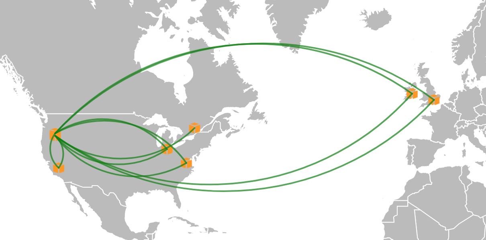

# Overview
This repository contains terraform configurations and related files to set up and tear down an Aviatrix demo environment.

# The Demo
This demo contains a base configuration as well as an extended configuration.  

## Initial Environment
When the demo environment is first built you will see an environment that looks like this:



This includes:
- [x] 1 Aviatrix Controller
- [x] 1 Services Hub VPC + Aviatrix Gateway
- [x] 1 Transit Hub VPC + Aviatrix Gateway
- [x] 1 "On Premise" Network + Aviatrix Gateway (simulated with a VPC in Canada)
- [x] 5 spoke VPCs + Aviatrix Gateways
- [x] Peering from all spokes to transit and services
- [x] Peering between transit and "On Premise"

## Extended Environment
An additional configuration is provided to represent an engineering request to create 2 empty VPCs and peer them to the services and transit hub.

This includes:
- [x] 2 VPCs in ca-central-1
- [x] Peering from each to transit and services

# Installation
Clone this repository in a directory of your choice.

## Prerequisites
- [Terraform](http://terraform.io)
- [brew](https://brew.sh) (on Mac OSX)
- [Go](https://golang.org/)
- [AWS Terraform provider](https://www.terraform.io/docs/providers/aws/)
- [Aviatrix Go SDK](https://github.com/AviatrixSystems/go-aviatrix)
- [Aviatrix Terraform provider](https://github.com/AviatrixSystems/terraform-provider-aviatrix)
- Accept the [terms](https://aws.amazon.com/marketplace/pp?sku=zemc6exdso42eps9ki88l9za) for using Aviatrix from the AWS marketplace

On Mac OSX you can use the provided shell script to install the prerequisites:
``` 
> scripts/install-prereqs.sh
```

# Usage

## Setting up the initial environment

Use the provided Shell script to set up the initial environment:

```
> scripts/build-demo.sh
```

This script will take about 20-30 minutes to run.  It builds all the components shown in the earlier section.


## Setting up the extended (engineering requested) environment

Use the provided Shell script to set up the extended environment:

```
> scripts/add-eng-request.sh
```

Or, run the terraform configuration manually:

``` shell
> cd steps/step-6-engineering
> terraform init .
> terraform apply -auto-approve -parallelism=1 -var-file=../../shared/aviatrix-admin-password.tfvars
```

## Destroying the engineering requested components

Use the provided Shell script to destroy the extended environment:

```
> scripts/destroy-eng-request.sh
```

Or, run the terraform destroy command manually:

``` shell
> cd steps/step-6-engineering
> terraform init .
> terraform destroy -force -parallelism=1 -var-file=../../shared/aviatrix-admin-password.tfvars
```

# Additional Details
## Terraform confiration layout
The terraform configuration files for the initial environment are contained in 5 separate directories.  These are referred to as "steps" in the `build-demo.sh` script file.  Each step is outlined below:

Step  | Description
----- | ------------
step-1-controller-service-hub | Creates a services VPC (including subnet, route table, and IGW).  Once complete, the [Aviatrix Quickstart](https://github.com/AviatrixSystems/AWSQuickStart) CloudFormation script is executed to build the roles and set up the Controller.  The Controller's public and private IP address are available at the end of this step.
step-2-aviatrix-init | Upgrades the Controller to the latest version.  At the end of this step, the CID is invalid and the user must re-login.  I have been unable to get automatically get a new CID (see attempts in goaviatrix/client.go) so this step is further split.
step-2.25-aviatrix-init | The Controller admin password is updated to the value stored in `init.tf` and the administrator email is set to the value in `init.tf`.  The CID is invalid after the password is updated, so once again it is split into another sub-step.
step-2.5-aviatrix-init | A new Controller account is created and linked to the AWS account.  And, the customer ID (license key) is set.
step-3-transit-hub | The transit hub VPC (and related components) is created and an Aviatrix gateway is installed.  The services VPC gateway is installed during this step too.
step-4-on-premise | A new VPC to represent the on-premise network is created and an Aviatrix Gateway is installed.  The on-premise Gateway is peered with the transit hub
step-5-spokes | 5 new spoke VPCs (and related components) is created along with a Gateway in each.  The Gateways are peered with the transit hub and the services hub.

Once complete the Controller's public IP (and URL) is displayed along with the default admin password.

